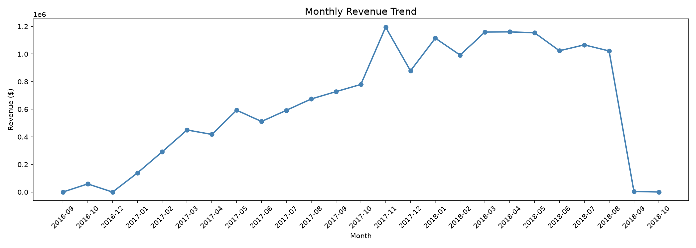

# Retail & E-Commerce Revenue Intelligence Platform

> An end-to-end data engineering and analytics platform built on real e-commerce data — featuring an automated ETL pipeline, AWS cloud infrastructure, statistical A/B testing, anomaly detection, and a live executive dashboard.

---

## Live Dashboard

> Run locally: `python dashboard/app.py` → open `http://localhost:8050`



---

## Project Summary

This project simulates a production-grade retail analytics system built from scratch. Starting from raw e-commerce CSV files, I designed and implemented a complete data pipeline that extracts, validates, transforms, and loads 100K+ real orders into a PostgreSQL data warehouse on AWS — then built an interactive executive dashboard with 5 analytical pages and a statistically validated A/B test.

**Dataset:** [Olist Brazilian E-Commerce](https://www.kaggle.com/datasets/olistbr/brazilian-ecommerce) — 100,000+ real orders across 8 relational tables (2016–2018)

---

## Architecture

```
Raw CSV Files (Kaggle)
        ↓
AWS S3 — Raw Data Lake
        ↓
Python ETL Pipeline
[Extract → Validate → Transform → Load]
        ↓
AWS RDS PostgreSQL — Star Schema Data Warehouse
[fact_orders | dim_customers | dim_products | dim_sellers | dim_reviews | dim_geolocation]
        ↓
SQL KPI Layer (7 business metrics + advanced window functions)
        ↓
Statistical Analysis & A/B Testing (scipy)
        ↓
Anomaly Detection (rolling statistical process control)
        ↓
Plotly Dash Executive Dashboard (5 pages, live data)
        ↓
AWS Lambda — Automated Weekly Pipeline Refresh
```

---

## Key Results

- Processed **100,000+ real orders** through automated ETL pipeline with data validation checks catching schema anomalies before warehouse ingestion
- Designed **star schema** data warehouse with 6 tables deployed on AWS RDS PostgreSQL
- Built **12 executive KPIs** including MoM revenue growth, customer LTV segments, delivery performance, and category revenue
- Conducted **A/B test** on shipping threshold pricing strategy using two-sample t-test (p=0.73, inconclusive — recommended live randomized experiment)
- Detected **19 revenue and order volume anomalies** using 7-day rolling statistical process control — including Black Friday 2017 spike ($149K vs $48K expected, 3x above baseline)
- Delivery time improved **76%** from 50+ days in 2016 to under 12 days by 2018 (identified through trend analysis)
- **59% of customers** gave 5-star reviews; late delivery identified as the primary driver of 1-star reviews

---

## Tech Stack

| Category | Technologies |
|---|---|
| Language | Python 3.14 |
| Data Processing | Pandas, NumPy |
| Statistical Analysis | SciPy (t-test, Cohen's d, confidence intervals) |
| Database | PostgreSQL, SQL (CTEs, window functions, stored procedures) |
| Cloud | AWS S3, AWS RDS, AWS EC2, AWS Lambda |
| Dashboard | Plotly Dash |
| Visualization | Matplotlib, Seaborn |
| Testing | pytest (11 unit tests) |
| Version Control | Git, GitHub |
| Database Client | DBeaver |

---

## Dashboard Pages

| Page | What It Shows |
|---|---|
| **Overview** | Revenue trend, MoM growth, state revenue, order status breakdown, YoY KPIs |
| **Operations** | Review score distribution, delivery timing, on-time rate, payment methods |
| **Products** | Category performance, revenue by day of week, average order value trends |
| **Customers** | LTV segments, geographic distribution, delivery performance over time |
| **A/B Test** | Statistical experiment results, distribution overlap, business impact estimate |

---

## Project Structure

```
retail-bi-platform/
├── data/
│   └── raw/                          # Olist CSV files (not committed)
├── etl/
│   ├── pipeline.py                   # Main pipeline runner (1 command)
│   ├── extract.py                    # Pull data from AWS S3
│   ├── validate.py                   # Data quality checks
│   ├── transform.py                  # Clean, reshape, build fact table
│   ├── load.py                       # Load to AWS RDS PostgreSQL
│   └── upload_to_s3.py               # Upload raw files to S3
├── sql/
│   ├── schema/
│   │   └── create_star_schema.sql    # Star schema DDL
│   └── queries/
│       ├── kpi_calculations.sql      # 7 business KPI queries
│       └── advanced_analytics.sql    # Window functions, cohort analysis
├── notebooks/
│   ├── 01_eda.ipynb                  # Exploratory data analysis
│   └── 03_ab_testing.ipynb           # A/B test with statistical analysis
├── dashboard/
│   └── app.py                        # Plotly Dash executive dashboard
├── automation/
│   ├── anomaly_detection.py          # Revenue & order volume anomaly detection
│   └── lambda_handler.py             # AWS Lambda pipeline trigger
├── analysis/                         # Saved charts and outputs
├── tests/
│   └── test_etl.py                   # 11 unit tests for ETL validation layer
├── .env.example                      # Environment variable template
├── requirements.txt
└── README.md
```

---

## How to Run

### 1. Clone and set up environment
```bash
git clone https://github.com/sang773/retail-bi-platform.git
cd retail-bi-platform
python3 -m venv venv
source venv/bin/activate
pip install -r requirements.txt
```

### 2. Configure environment variables
```bash
cp .env.example .env
# Fill in your AWS and RDS credentials
```

### 3. Run the full ETL pipeline
```bash
python etl/pipeline.py
```

### 4. Launch the dashboard
```bash
python dashboard/app.py
# Open http://localhost:8050
```

### 5. Run anomaly detection
```bash
python automation/anomaly_detection.py
```

### 6. Run tests
```bash
python3 -m pytest tests/test_etl.py -v
```

---

## Key Findings

**Revenue Growth**
- Business grew from near zero in late 2016 to $990K/month peak in November 2017
- Average month-over-month growth rate of ~18% through 2017
- Revenue stabilized at $800K–$900K/month through 2018 indicating market maturity

**Operations**
- Average delivery time improved 76% from 50+ days (2016) to under 12 days (2018)
- Credit card accounts for 79.7% of revenue; Boleto (Brazilian bank slip) is second at 17.6%
- Late delivery is the single biggest predictor of 1-star reviews

**Customer Intelligence**
- 84.9% of customers are Low Value (under $200 total spend)
- Only 3.6% are High Value (over $500) — high ROI opportunity for loyalty programs
- São Paulo (SP) generates 40%+ of total revenue

**Anomaly Detection**
- Black Friday 2017 (Nov 24): $149,916 revenue vs $48,089 expected — 3.1x spike, 1,147 orders
- System correctly flagged 9 revenue anomalies and 10 order volume anomalies across 612 days

**A/B Test**
- Hypothesis: reducing free shipping threshold from $100 to $50 increases average order value
- Result: p-value 0.73 — inconclusive on historical data
- Recommendation: run a live randomized experiment for a statistically clean result

---

## What I Learned

- Designing production-grade ETL pipelines with validation, error handling, and automated scheduling
- Star schema data warehouse design and complex SQL (CTEs, window functions, cohort analysis)
- Deploying cloud infrastructure on AWS (S3, RDS, EC2, Lambda)
- Statistical A/B testing methodology including effect size and confidence intervals
- Building interactive business intelligence dashboards with real-time database connections
- Anomaly detection using rolling statistical process control

---

## Author

**Sangit Gaire**
Computer Science + Data Science | Georgia State University
Delta Analytics Scholar | Research Assistant | Vice President of NSDC @GSU

[LinkedIn](https://www.linkedin.com/in/sangitgaire/) · [GitHub](https://github.com/sang773)